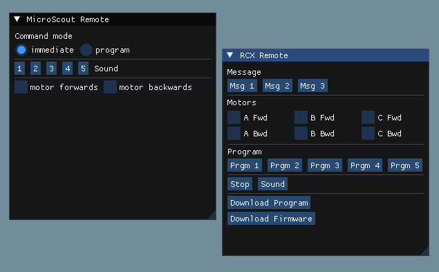

# IBT (Infrared Brick Tower)

IBT is a project to bring new life to the Lego Mindstorms RCX USB infrared transmission tower for modern operating systems.



This is very work-in-progress. Feel free to contribute by submitting a pull request or by opening issues!

## Background
I'm building this project because, first of all, it's fun, and Legos (I know Legos isn't the correct plural term, but it's fun to say; fight me in the GitHub issues) are pretty cool. The other big reason that I think there's a need for this is that there's barely any community support for this Lego Mindstorms generation nowadays (let alone official support), and there's no way to use the USB version of the tower on 64-bit Windows. (Allegedly the serial version of the tower works on modern Windows with an adapter, but I don't have one to test.)

## Building

### Part 1: Submodules

From the main project folder, run:
```
git submodule update --init --recursive
```

### Part 2: Setup
- #### Windows
    This project is in two parts on Windows. The main part is the desktop application, and the second part is the actual USB driver. Before building the desktop application, you need to open the Visual Studio solution file in Visual Studio 2022 and build the solution.

- #### Linux
    For the USB tower to work on Linux, follow the instructions [here](https://pbrick.info/index.html-p=178.html).
    Additionally, there's a set of packages you'll need. Here's what that'll look like on an Ubuntu-based system:
    ```
    sudo apt install ninja-build curl libxinerama-dev libxcursor-dev xorg-dev libglu1-mesa-dev pkg-config autoconf libudev-dev dh-autoreconf freeglut3-dev gdb make
    ```

### Part 3: Success

From here, you'd probably be able to use whichever C++ IDE you like, as long as it supports CMake. Personally, I use Visual Studio Code with Microsoft's CMake Tools extension. Build the project and have fun!


### Just For Fun
An image of the USB infrared transmission tower:


## Contributing
If you have changes you'd like to make or recommendations, feel free to open a pull request or an issue!

## License
[GNU GPL v3.0](https://choosealicense.com/licenses/gpl-3.0/)
