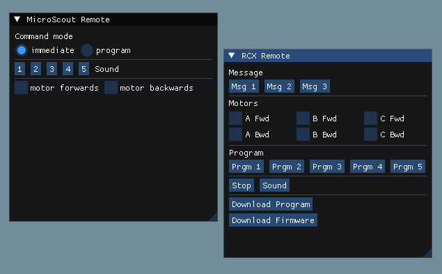
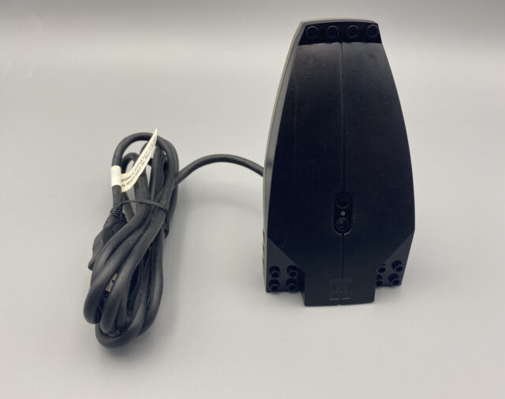

# IBT (Infrared Brick Tower)

IBT is a project to bring new life to the Lego Mindstorms RCX USB infrared transmission tower for modern operating systems.



This is very work-in-progress, and everything might not yet work as expected. Feel free to contribute by submitting a pull request or by opening issues!

## Background
In 2001, Lego released the [Robotics Invention System 2.0 (set number 3804)](https://brickset.com/sets/3804-1/Robotics-Invention-System-V2-0). Containing a programmable brick (the RCX) and a variety of motors and sensors, this set was a way for burgeoning engineers and developers to explore robotics and software at a young age. Unfortunately, the original Windows driver for the USB communication tower used to program the RCX does not support 64-bit systems (the tower is pictured below). This project was built to fill that gap.

Beyond supporting the USB tower on modern Windows operating systems, this project provides a more modern way to control and program the RCX and other older Lego programmable bricks (such as the Scout and MicroScout) by reimplementing functionality from many of the tools included in the now-obselete Mindstorms SDKs and various tools from the early 2000s, such as LASM support. 

## Building

### Part 1: Submodules

From the main project folder, run:
```
git submodule update --init --recursive
```

### Part 2: Setup
- #### Windows
    This project is in two parts on Windows. The main part is the desktop application, and the second part is the actual USB driver. Before building the desktop application, you need to open the Visual Studio solution file in Visual Studio 2022 and build the solution.

- #### Linux
    For the USB tower to work on Linux, follow the instructions [here](https://pbrick.info/index.html-p=178.html).
    Additionally, there's a set of packages you'll need. Here's what that'll look like on an Ubuntu-based system:
    ```
    sudo apt install ninja-build curl libxinerama-dev libxcursor-dev xorg-dev libglu1-mesa-dev pkg-config autoconf libudev-dev dh-autoreconf freeglut3-dev gdb make
    ```

### Part 3: Success

From here, you'd probably be able to use whichever C++ IDE you like, as long as it supports CMake. Personally, I use Visual Studio Code with Microsoft's CMake Tools extension. Build the project and have fun!

---

An image of the USB infrared transmission tower:



## Contributing
If you have changes you'd like to make or recommendations, feel free to open a pull request or an issue!

## License
[GNU GPL v3.0](https://choosealicense.com/licenses/gpl-3.0/)
